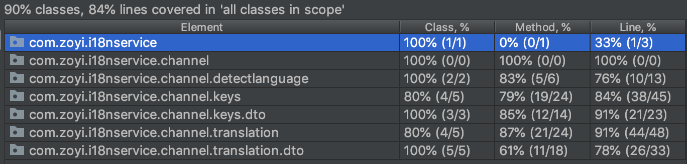

# Channel Backend 과제
> I18N Service
번역 될 문장을 나타내는 Key를 중심으로 여러 언어로의 번역을 지원

사용 언어는 JAVA 입니다.
TDD 사이클을 준수하며 개발하였고, 필요한 부분만 테스트를 작성하였습니다.

Language detect는 `detectlanguage API` 사용하였습니다.
API KEY는 application.yml 파일에 추가 후 빌드해주세요. 

### 개발환경
- JDK 1.8
- SpringBoot 2.1.7 RELEASE
- Gradle  
- JPA
- MySQL (dev)
- H2 (test)
- Lombok
- Embedded Tomcat
- TEST : JUnit 5, MockMVC, AssertJ

---
### DB 
- Test H2를 사용
- Dev DB(MySQL) 사용

### DB Modeling
Key

| Field Name | Type    | Description                                 |
|------------|---------|---------------------------------------------|
| id         | Integer |                                             |
| name       | String  | Key의 이름으로 dot와 영어 소문자만 사용가능 (unique) |


Translation
| Field Name | Type    | Description                             |
|------------|---------|-----------------------------------------|
| id         | Integer |                                         |
| keyId      | Integer  | Key의 ID                                |
| locale     | String  | ISO 639 Alpha-2 형식. ko, en, ja만 유효   |
| value      | String  | 번역된 문장                               |

### Package structure
    ```
    .
    +-- config
    +-- global
    +-- domain
        +-- detectlanguage
        +-- keys
            +-- dto
        +-- translation
            +-- dto
    ```      
 
### 테스트 커버리지

  
---

### 실행 방법
[Docker 설치](https://docs.docker.com/install/) 
 
0. MySQL 세팅 및 실행
Host : localhost:3306/channel 
```

$ docker-compose -d up
 
```

1. (Gradle) Application Jar file build
```

$ ./gradlew build
 
```
2. Application 실행
```

$ java -Dspring.profiles.active=dev -jar ./build/libs/i18n-service-1.0.jar
 
```

### API Specification
- 모든 키 가져오기
    * API Endpoint: /keys
    * Method: GET
    * Query Parameter: 
        | Field Name | Type   | Description                        |
        |------------|--------|------------------------------------|
        | name       | String | Optional. 검색하고 싶은 key의 이름 |
    * Example Response: 
        ```
        {
            "keys": [
                {
                    "id" : 1,
                    "name" : "test.key.first.one"
                },  {
                    "id" : 2,
                    "name" : "test.key.second.one"
                }
            ]
        } 
        ```
    * ```
        curl 'http://localhost:8080/keys' -i -X POST -d '{"name":"keys"}'
      ```         

- 키 추가하기
    * API Endpoint: /keys
    * Method: POST
    * Example Payload:
        ```
        {
            "name" : "test.key.first.one"
        } 
        ```
    * Example Response: 
         ```
        {
            "key": {
                "id" : 1,
                "name" : "test.key.first.one"
            }
        } 
        ```
    * ```
      curl 'http://localhost:8080/keys' -i -X POST -H "Content-Type: application/json" -d '{"name":"keys"}'
      ```

- 키 수정하기
    * API Endpoint: /keys/{keyId}
    * Method: PUT
    * Example Payload:
        ```
        {
            "name" : "test.key.revised.first.one"
        } 
        ```
    * Example Response: 
         ```
        {
            "key": {
                "id" : 1,
                "name" : "test.key.revised.first.one"
            }
        } 
        ```

- 번역 추가하기
    * API Endpoint: /keys/{keyId}/translations/{locale}
    * Method: POST
    * Example Payload:
        ```
        {
            "value" : "It's first one."
        } 
        ```
    * Example Response: 
         ```
        {
            "translation": {
                "id": 1,
                "keyId": 1,
                "locale": "en",
                "value": "It's first one." 
            }
        } 
        ```

- 키의 모든 번역 확인하기
    * API Endpoint: /keys/{keyId}/translations
    * Method: GET
    * Example Response: 
         ```
        {
            "translations": [
                {
                    "id": 1,
                    "keyId": 1,
                    "locale": "en",
                    "value": "It's first one." 
                },
                {
                    "id": 2,
                    "keyId": 1,
                    "locale": "ko",
                    "value": "첫번째 것 입니다." 
                }
            ]
        } 
        ```

- 키의 특정 언어 번역 확인하기
    * API Endpoint: /keys/{keyId}/translations/{locale}
    * Method: GET
    * Example Response: 
         ```
        {
            "translation": {
                "id": 1,
                "keyId": 1,
                "locale": "en",
                "value": "It's first one." 
            }
        } 
        ```

- 키의 특정 언어 번역 수정하기
    * API Endpoint: /keys/{keyId}/translations/{locale}
    * Method: PUT
    * Example Payload:
        ```
        {
            "value" : "It's revised first one."
        } 
        ```
    * Example Response: 
         ```
        {
            "translation": {
                "id": 1,
                "keyId": 1,
                "locale": "en",
                "value": "It's revised first one." 
            }
        } 
        ```

- Language detect
    * API Endpoint: /language_detect
    * Method: GET
    * Query Parameter: 
        | Field Name | Type   | Description                        |
        |------------|--------|------------------------------------|
        | message    | String | Required. String to find locale.   |
    * Example Response:
        ```
        {
          "locale": "en"
        }
        ```
    * ```
        curl 'http://localhost:8080/language_detect?message=Hello' \ 
        -i -X GET -H "Content-Type: application/json"
      ```
    * https://detectlanguage.com/ 의 API를 사용해주시면 됩니다. (다른 API를 활용하셔도 됩니다.)
    
    
    
        
  